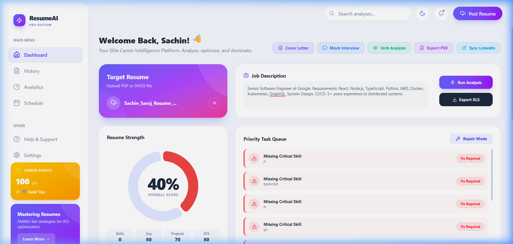
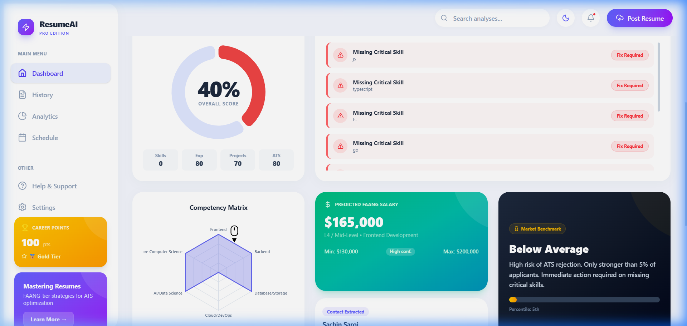
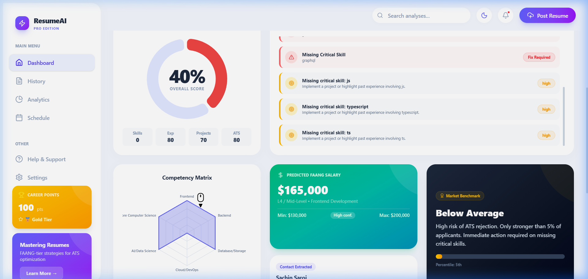
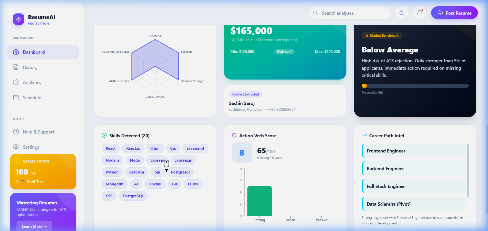
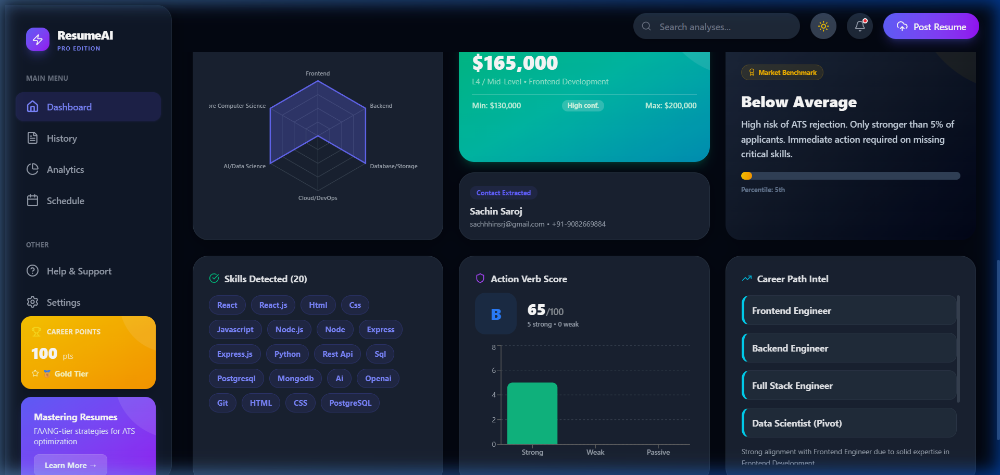
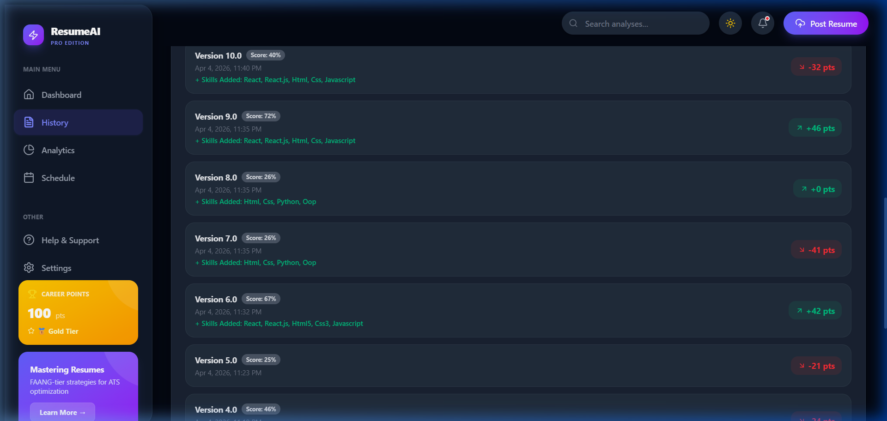

# 🚀 AI Resume Analyzer PRO — Elite Career Intelligence

An enterprise-grade, locally-hosted platform that deeply parses your resume, cross-references it with target job descriptions, and provides actionable intelligence to boost your ATS compatibility and secure FAANG-tier interviews.

---

<p align="center">
  
  
  
  
  
</p>

---

## ✨ Features

- **Advanced PDF Parsing:** Utilizes robust buffer-level extraction with dynamic fallbacks to perfectly read highly complex PDF layouts.
- **Real-time Gap Analysis:** Instantly diffs your current resume against provided job descriptions.
- **Grammar & Action Verb NLP:** Scans for weak verbs (e.g., "helped with", "worked on") and suggests commanding alternatives (e.g., "Architected", "Spearheaded").
- **Offline-First Architecture:** Supports full in-memory fallback for both analysis records and user authentication when MongoDB is unreachable, allowing local development runs to function completely offline without Mongoose connection requirements.
- **Strict User Isolation:** Enforces JWT-based authentication middleware on the API server and dynamic Axios interceptors in the client, ensuring user history, career points, and analyses are never mixed or leaked.

---

## 🛠️ Tech Stack

**Frontend:**
- React (Vite)
- Tailwind CSS (v4)
- Recharts (Data Visualization)
- Lucide React (Icons)
- Context API (State Management)

**Backend:**
- Node.js & Express.js
- MongoDB & Mongoose
- `pdf-parse` (v2 API for high-accuracy text extraction)
- Multer (in-memory file handling)
- Zod (Type-safe input validation)

---

## 🔐 Authentication & Offline Fallback Mode

To prevent user data leakage (where resume version history, scores, and points get mixed between different local or remote users), this platform enforces **strict JWT-based authentication**:

- **Strict Route Protection:** All API endpoints are protected by token verification middleware. Missing, malformed, or expired headers are rejected immediately with a `401 Unauthorized` status.
- **Client Session Persistence:** The React client automatically stores the JWT securely in `localStorage` and includes an Axios request interceptor to inject the token into all outgoing requests.
- **Mongoose Offline Fallback:** If MongoDB is offline, or no `MONGODB_URI` environment variable is defined, the backend degrades gracefully to an in-memory database fallback (`global.OFFLINE_USERS`). You can register, login, and access different user profiles locally completely database-free.
- **Intelligent Local Skill Matcher:** When running locally (without external cloud APIs like OpenAI), the matching engine utilizes a custom local fuzzy-matcher combining tech-ontology synonym mappings (e.g. `ReactJS` <=> `React.js`), normalization filters, string-similarity algorithms (Jaro-Winkler), and language exclusions (to prevent Java vs. JavaScript false positives).

---

## 📸 Platform Showcase

### 1. The Dashboard (Instant Analysis)
Get a comprehensive 0-100 score, immediately identifying how well you map against your target role.


### 2. Missing Skills & Priority Task Queue
Actionable steps categorized by severity (High/Medium/Low) highlighting exact technical or soft skills missing from your resume context.


### 3. Competency Matrix & Salary Intel
A radar chart visualizing your strengths (Frontend vs Backend vs System Design) alongside a data-driven projected FAANG salary band based on your extracted seniority.


### 4. Advanced Keyword & Action Verb Tracking
Detects passive vs. strong action verbs to ensure your bullet points lead with impact. Also provides intelligent career trajectory recommendations.


### 5. Premium Dark Mode
Sleek, eye-protective dark mode available out of the box with dynamic theme switching.


### 6. Version History & Score Deltas
Track your resume optimizations over time, seeing exactly how many score points you gained and what skills you successfully added to beat the ATS.


---

## ⚡ Getting Started (Local Setup)

### Prerequisites
- Node.js (v18+)
- MongoDB (running locally or a web cluster URI)

### 1. Clone & Install
```bash
# Clone the repository
git clone https://github.com/your-username/SUMMcmap-pro.git
cd "SUMMcmap-pro/AI Resume Analyzer PRO"

# Install all dependencies (Client + Server concurrently)
npm run install-all
```

### 2. Environment Configuration
Create a `.env` file inside the `server/` directory:
```env
PORT=5000
MONGODB_URI=mongodb://127.0.0.1:27017/resume-analyzer
JWT_SECRET=your_super_secret_jwt_key
NODE_ENV=development
```

### 3. Run the Platform
You can start both the frontend and backend with a single command from the root folder:
```bash
npm run dev
```

The application will spin up at:
- Frontend: `http://localhost:5173`
- Backend API: `http://localhost:5000`

---

## 🐛 Recent Patches & Stability Improvements
- **PDF Extraction Engine Migration:** Transitioned entirely from deprecated v1 `pdf-parse` callbacks to stable v2 Class-based extraction (`new PDFParse({ data: buffer })`).
- **Render Stability Matrix:** Replaced unstable JS-based layout sizing with deterministic CSS keyframes, resolving prior Recharts dimension collapse warnings.
- **Bulletproof Global Error Boundries:** Integrated React boundary wrapping to prevent the "White Screen of Death", allowing smooth state recoveries across the entire app.

---

*Built for Engineers, by Engineers. Dominate the ATS.*


## Changelog
- **[#37]** Document Docker container layout setup (7)
- **[#35]** Optimize index search fields in schema (6)
- **[#33]** Add test assertions for categorizations logic (5)
- **[#31]** Improve timeout handling for api queries (4)
- **[#29]** Add performance telemetry logs (3)
- **[#27]** Refactor error alerts to use inline visual banners (2)
- **[#25]** Fix console warning in chart rendering (1)
- **[#23]** Add test coverage assertion for skill categorizations
- **[#21]** Improve timeout handling for client API requests
- **[#19]** Add console logs for resume parser performance telemetry
- **[#17]** Refactor Auth error alerts to use inline visual banners